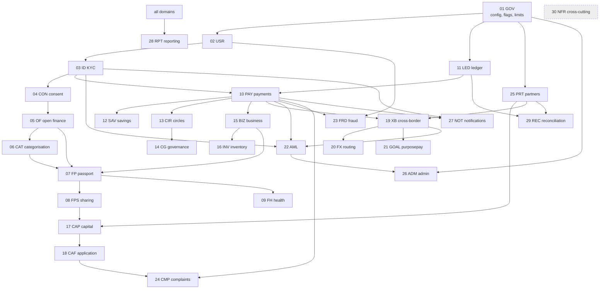

# BFR-ANA-001 — URS Analysis: Dependencies, Ambiguities and Assumptions

**Realises URS §30 Step 1.** Input: `BFR-URS-001` (300 requirements).
**Output:** build-order dependency graph, ambiguity register, assumption register.

---

## 1. Dependency analysis

### 1.1 Foundation layer — nothing else can be correct without these

| Layer | Domains | Why it is foundational |
|---|---|---|
| **L0 Configuration & governance** | `GOV` | Every "configurable" acceptance criterion in the other 29 domains resolves against the same configuration service. Limits (`GOV-006`), flags (`GOV-004/005`), effective dating (`GOV-007`) and maker-checker (`GOV-008`) are referenced by 61 downstream requirements. Building any domain before `GOV` guarantees hard-coded thresholds and a failed `GOV-001` acceptance test. |
| **L0 Audit** | `NFR-006`, `ADM-010`, `GOV-010`, `USR-010` | Audit is written by every other domain. It must be append-only from the first commit; retrofitting immutability after data exists is not achievable without migration of unauditable history. |
| **L0 Identity & RBAC** | `USR`, `ID` | Authorisation decisions in 27 domains depend on customer identity, KYC tier and role. `ID-007` (privileges depend on KYC status) is a precondition for every money-movement requirement. |
| **L1 Ledger** | `LED` | `PAY`, `SAV`, `CIR`, `XB`, `GOAL`, `REC` all post to it. `LED-005` (no binary floating point) is a data-type decision that cannot be reversed cheaply once monetary columns exist. |
| **L1 Consent** | `CON` | `OF`, `FP`, `FPS`, `FH`, `CAP`, `CAF`, `CG-008` all require a consent reference on every read of customer financial data. A consent ID is a mandatory foreign key on imported data (`OF`) — adding it later means unprovenanced historical data. |

### 1.2 Directed dependency graph

### 1.3 Critical build order (drives URS §30 Steps 7–12)

| Wave | Contents | Gate before next wave |
|---|---|---|
| **W1 Foundation** (§30 Step 7) | `GOV`, `USR`, `ID`, `CON`, `LED`, audit + auth standards | Ledger balances under concurrency; audit append-only proven; maker-checker enforced |
| **W2 Financial inclusion core** (Step 8) | `OF`, `CAT`, `FP`, `FPS`, `FH` | Every Passport metric carries provenance + version + explanation |
| **W3 Economic activity** (Step 9) | `PAY`, `BIZ`, `SAV`, `CIR`, `CG`, `INV` | Payment state machine + idempotency proven; Circle history immutable |
| **W4 Access marketplace** (Step 10) | `CAP`, `CAF`, `PRT` | Provider identity displayed everywhere; no BuntuFin lending representation |
| **W5 Cross-border** (Step 11) | `XB`, `FX`, `GOAL` | Quote expiry enforced; deterministic rounding; screening before release |
| **W6 Regulatory operations** (Step 12) | `AML`, `FRD`, `REC`, `CMP`, `RPT`, `ADM`, `NOT` | Sandbox KPI pack producible end-to-end |

`NFR` (Domain 30) is **not a wave** — it is a set of standing constraints
verified continuously in CI from W1 onward.

### 1.4 Cross-domain coupling hot-spots

These are the points where a design mistake in one domain silently breaks another.
Each is assigned an explicit owning component in `BFR-ARC-004`.

| Hot-spot | Requirements coupled | Design decision that resolves it |
|---|---|---|
| **Consent reference on every derived figure** | `CON-009`, `OF-006`, `FP-008`, `FPS-006`, `CAP-005`, `CAF-008`, `CG-008` | `consent_id` is a **non-null** column on `connected_account`, `passport_metric_source` and `partner_disclosure`. No read path exists that omits it. |
| **"Configurable" means one config service** | 61 requirements | Single `platform_config` + `config_version` with effective dating (`GOV-007`); no domain keeps private thresholds. |
| **Authoritative state vs displayed state** | `PAY-001`, `PAY-008`, `SAV-010`, `CAF-006`, `XB-009`, `GOAL-008` | UI reads only projections derived from ledger/partner-confirmed state. No optimistic "success" rendering anywhere. |
| **Immutability vs correction** | `LED-002/003`, `CIR-008`, `FRD-010`, `ADM-006`, `NFR-006` | Append-only tables + reversal linkage; `DELETE`/`UPDATE` privileges withheld from the application role at database level. |
| **Versioning of anything that produces a number** | `CAT-008/009`, `FP-009`, `FH-010`, `PRT-008`, `GOV-003`, `CON-010`, `CIR-005` | A common `versioned_artefact` pattern: `(artefact_type, version, effective_from, author, approver)` reused by seven domains. |
| **Provider identity disclosure** | `GOV-002`, `SAV-009`, `CAP-002/008`, `FH-007`, `GOAL-009` | `legal_provider_id` is a mandatory attribute of every product configuration; UI components refuse to render a product without it. |

---

## 2. Ambiguity register

Ambiguities are URS statements that admit more than one reasonable
implementation. Each is resolved here with a **documented interpretation** so
development is not blocked; each interpretation is flagged for confirmation at
URS review. Ambiguities that cannot be safely interpreted are escalated to
`BFR-ANA-002` (stop-list) instead.

| # | Requirement(s) | Ambiguity | Adopted interpretation | Confirm with |
|---|---|---|---|---|
| A-01 | `PAY-001` | "Available transaction position" — is BuntuFin holding funds or displaying a partner balance? | Both models supported. A position is either `LEDGER_BACKED` (BuntuFin ledger account) or `PARTNER_MIRRORED` (read-through of partner balance, never used for authorisation without a partner check). Product config declares which. | Legal / partner |
| A-02 | `LED-005` | "Fixed precision or integer minor units" | Integer **minor units** stored as `BIGINT` plus explicit `currency_code` and `scale` from a currency reference table. RWF scale is configuration, not a constant (see `BFR-ANA-002` Q-11). | Finance |
| A-03 | `CAT-003` | "Correction does not overwrite original" | Two columns retained (`system_category`, `customer_category`) plus an append-only `transaction_category_history`. Passport reads a resolved view that prefers customer category but records which was used. | Product |
| A-04 | `FP-008` | "Explainable" | Deterministic **reason codes** (URS §8) rendered through localised templates. No generative text in the regulated release. | Regulatory |
| A-05 | `FPS-003/004` | Relationship between time-limited and one-time sharing | One authorisation entity with two independent controls: `expires_at` and `max_access_count`. One-time share = `max_access_count = 1`. | Product |
| A-06 | `SAV-002` | "transfer/instruction" — does BuntuFin move money or instruct a provider? | Both. `savings_rule.execution_mode ∈ {INTERNAL_TRANSFER, PROVIDER_INSTRUCTION}` set by the savings product's regulated provider configuration. | Legal / partner |
| A-07 | `CIR-007` | "Authorised members see group transactions" | Members see the full Circle ledger for cycles in which they were members, with other members' personal identifiers limited to display name. | Product / privacy |
| A-08 | `CG-002` | N-of-M approvals — who is eligible? | Approver set is a Circle role (`ADMIN`/`SIGNATORY`), configured per Circle rule version; M is the count of active signatories at proposal creation, frozen for that proposal. | Product |
| A-09 | `BIZ-006` | Manual cash sale vs verified receipt | `evidence_type ∈ {VERIFIED_DIGITAL, SELF_REPORTED}` on every merchant sale; Passport reports the two separately and never sums them into a single "verified" figure (`BIZ-010`, `FP-007`). | Regulatory |
| A-10 | `CAP-009` | "Fair" ranking | Default ordering is by customer-relevant criteria (total cost of credit, then speed to decision, then provider service level). Commission is not an input. Ranking policy is versioned config and displayed to the customer on request. | Regulatory / product |
| A-11 | `XB-002` | Quote direction | Quote request carries `quote_direction ∈ {SEND_FIXED, RECEIVE_FIXED}`; corridor config declares which directions are permitted. | Product |
| A-12 | `FX-008` | "Deterministic rounding" | Rounding mode, precision and order of operations are attributes of the **quote**, persisted with it, so a replay reproduces the exact minor-unit result. Default: half-even at the receive currency's scale, applied after fee deduction. | Finance |
| A-13 | `GOAL-009` | Recipient-owned vs sender-directed | `allocation.control_model ∈ {RECIPIENT_OWNED, SENDER_DIRECTED}` with distinct UI copy and distinct ledger treatment (recipient-owned credits a recipient account; sender-directed pays a verified biller). | Legal |
| A-14 | `AML-001` | "Applicable customers" | All customers at onboarding, on identity data change, on list refresh, and before cross-border release. Scope per screening policy version. | Compliance |
| A-15 | `FRD-005` | Risk level scale | `LOW/MEDIUM/HIGH/CRITICAL` persisted alongside the numeric score and the rule-set version that produced it. | Fraud ops |
| A-16 | `RPT-002` | "Active user" definition | Configurable; default = at least one authenticated session **and** one completed financial or Passport action in the reporting period. Definition version is printed on every report. | Regulator |
| A-17 | `NFR-008` | 99.9% of what | Measured against the customer-facing critical journey set (auth, position, payment, transfer status) via synthetic probes, excluding approved maintenance windows. | Operations |
| A-18 | `ADM-004` | Masking granularity | Field-level masking policy bound to role, evaluated server-side; masked values never leave the service boundary in unmasked form. | Security |

---

## 3. Assumption register

Assumptions are things development will proceed on **unless contradicted**.
Each carries a risk rating for the impact if the assumption turns out false.

| # | Assumption | Affected requirements | Impact if false |
|---|---|---|---|
| S-01 | BuntuFin operates in the sandbox as a **technology and aggregation provider**, with regulated products provided by licensed partners. | `GOV-002`, `SAV-009`, `CAP-002`, `PAY-001` | **High** — changes which entity holds funds, and therefore the ledger's legal meaning and the licensing model. |
| S-02 | Customer funds, where held, sit in a partner-held trust/float account mirrored by the BuntuFin ledger; the BuntuFin ledger is a **record**, not the legal book of the funds. | `LED-*`, `REC-*` | **High** — reconciliation design and settlement obligations change materially. |
| S-03 | Sandbox cohort size is bounded and cohort membership is administered by BuntuFin, not self-service. | `GOV-005`, `RPT-001` | Low |
| S-04 | Mobile money is the dominant connected data source in Rwanda; bank and SACCO coverage is partial at sandbox stage. | `OF-002/003/004`, `FP-001` | Medium — Passport minimum-data thresholds may be unachievable for most customers. |
| S-05 | Identity verification uses one primary national identity source plus a document/biometric fallback provider. | `ID-004/005/009` | Medium — see `BFR-ANA-002` Q-03. |
| S-06 | Sanctions and PEP data are supplied by a commercial screening provider under licence; BuntuFin does not curate lists itself. | `AML-001/002` | Medium — self-curated lists shift maintenance and audit burden onto BuntuFin. |
| S-07 | Cross-border corridors launch outbound-from-Rwanda first, with a small number of partner-operated payout networks. | `XB-*`, `FX-*` | Medium |
| S-08 | Kinyarwanda is the primary customer language; English is the primary staff/admin language; French is supported for customer surfaces. | §18, all customer UI | Low — affects translation volume, not architecture. |
| S-09 | USSD is delivered through an aggregator over one or more MNO short codes, not a direct MNO integration per operator. | §19 | Medium — session/timeout semantics differ per aggregator. |
| S-10 | Personal data may be processed in a cloud region outside Rwanda **unless** localisation is mandated. | `NFR-002`, §16 | **High** — a localisation mandate changes hosting, DR design and cost. See `BFR-ANA-002` Q-14. |
| S-11 | The sandbox does not require real-time regulatory reporting; periodic reporting packs are acceptable. | `RPT-*` | Medium |
| S-12 | No machine-learning model makes a customer-affecting decision in the first regulated release; categorisation is rules-first with an optional ML assist that is always correctable. | §9, `CAT-001`, `FH-*` | Low — this is a deliberate constraint, not a limitation. |

---

## 4. Regulatory control points

These are the places where the design must produce **evidence**, not just
function. Each maps to a sandbox release gate in `BFR-REL-001`.

| Control point | Evidence artefact | Requirements |
|---|---|---|
| Customer is who they claim to be | KYC decision record with provider provenance | `ID-003/004/005/009` |
| Customer permitted each use of their data | Consent record + disclosure log, per access | `CON-001…010`, `FPS-006` |
| Money moved is money recorded | Balanced journal, reconciled to partner | `LED-001/009`, `REC-001…006` |
| Nothing was silently changed | Append-only audit + reversal linkage | `NFR-006`, `LED-002/003`, `CIR-008`, `FRD-010` |
| Derived figures can be defended | Algorithm version + inputs + reason codes | `FP-008/009`, `CAT-008/009`, `FH-002/008/010` |
| The customer was told who they are dealing with | Provider disclosure on every product surface | `GOV-002`, `SAV-009`, `CAP-002/008` |
| Financial crime controls ran before release of funds | Screening record before `SENT_TO_PARTNER` | `XB-008`, `AML-001/002` |
| Customers can complain and be heard | Complaint with SLA and outcome | `CMP-001…010` |
| Every requirement was actually tested | RTM with test result and evidence link | `NFR-009/010` |

---

## 5. Requirements that are *not* independently buildable

The following requirements have **no standalone implementation** — they are
satisfied by a platform-wide mechanism and must be tested as properties of
other features rather than as separate deliverables. They still carry their own
test cases in the RTM.

| Requirement | Realised as a property of |
|---|---|
| `GOV-010`, `USR-010`, `ADM-010`, `NFR-006` | The audit service; verified by a conformance test applied to every write path |
| `NFR-001/002/003` | Platform/infrastructure controls, verified in CI and by security testing |
| `NFR-004` | The idempotency middleware, verified per money-moving endpoint |
| `NFR-005` | The API error contract, verified by a schema conformance test on all endpoints |
| `NFR-009/010` | The CI pipeline and RTM generator themselves |
| `INV-010` | A negative test: merchant payment acceptance works with an empty catalogue |
| `LED-005` | A static analysis rule forbidding float types on monetary paths |
