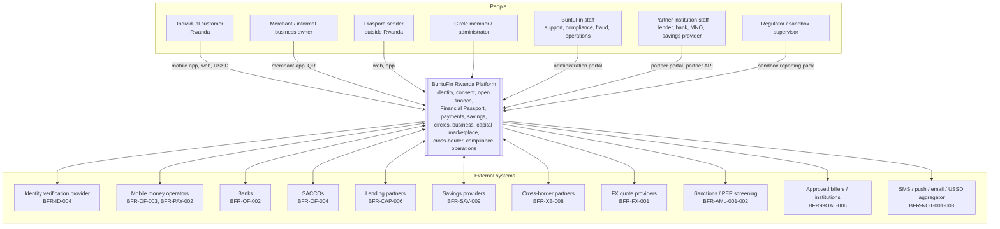

# BFR-ARC-001 — C4 Level 1: System Context

**Realises URS §30 Step 2.**

## 1. Context diagram

## 2. Actors

| Actor | Primary needs | Key requirements |
|---|---|---|
| Individual customer | Prove financial identity, pay, save, join Circles, access financing, receive remittances | `ID-*`, `PAY-*`, `SAV-*`, `CIR-*`, `FP-*` |
| Merchant / informal business | Accept payments, record cash sales, see turnover, build a financial record, access working capital | `BIZ-*`, `INV-*`, `CAP-*` |
| Diaspora sender | Send money with a known landed amount and known purpose | `XB-*`, `GOAL-*` |
| Circle member / administrator | Run a transparent group savings scheme with governance | `CIR-*`, `CG-*` |
| BuntuFin staff | Operate, support, investigate, report — under least privilege and full audit | `ADM-*`, `AML-*`, `FRD-*`, `CMP-*`, `REC-*` |
| Partner staff | Receive authorised customer data, return offers and decisions, reconcile | `PRT-*`, `CAP-*`, `CAF-*` |
| Regulator | Receive sandbox KPI and control evidence | `RPT-*`, `NFR-010` |

## 3. External system responsibilities and trust posture

| External system | BuntuFin treats it as | Consequence in design |
|---|---|---|
| Identity verification provider | **Authoritative** for identity assertion; not authoritative for eligibility | Provenance stored (`ID-009`); the eligibility decision remains BuntuFin's, based on configured tier rules |
| Mobile money / bank / SACCO | **Authoritative** for the customer's transaction data at that institution | Imported data is never edited (`OF-006`); corrections are overlays (`CAT-003`) |
| Payment rail / cross-border partner | **Authoritative** for settlement outcome | UI shows partner-confirmed state only (`PAY-008`, `XB-009`, `CAF-006`) |
| Lending partner | **Authoritative** for credit decision and disbursement | BuntuFin never invents a decision or a decline reason (`CAF-004`), never represents itself as lender (`CAP-002`) |
| Screening provider | **Authoritative** for list content; not for the disposition | Match creates a case for human decision (`AML-002`, `AML-006`) |
| FX provider | **Authoritative** for the raw rate | Customer-facing rate composition and rounding are BuntuFin's, recorded on the quote (`FX-008`) |
| Comms providers | Best-effort delivery | Delivery status recorded when supplied (`NOT-010`); never a proof of customer awareness |

## 4. Context-level constraints

1. **No external system may read customer data without a consent reference.**
   Every outbound disclosure carries `consent_id` and is logged (`CON-009`).
2. **No external system is trusted for authorisation.** Partner responses set
   *state*, never *permission*.
3. **Every external interaction goes through an adapter** (`BFR-STD-003`); no
   provider-specific type reaches a domain service (`OF-002`, `OF-003`, `FX-001`).
4. **Every external interaction is logged** with correlation ID, latency and
   outcome (URS §14, `NFR-005`).
