# BFR-ARC-002 — C4 Level 2: Containers

**Realises URS §30 Step 2.**

## 1. Container diagram

```mermaid
graph TB
  subgraph Clients
    APP[Customer mobile app<br/>low-bandwidth first · BFR-NFR-007]
    WEB[Customer web]
    USSD[USSD gateway handler<br/>URS §19]
    MAPP[Merchant app]
    ADMUI[Administration portal<br/>BFR-ADM-001]
    PPORT[Partner portal]
  end

  subgraph Edge
    GW[API gateway<br/>TLS · rate limit · replay protection<br/>BFR-NFR-001 · URS §14]
    IDP[Auth service<br/>OTP · PIN · biometric · refresh rotation<br/>step-up · device mgmt · URS §4]
  end

  subgraph "Core services"
    CFG[config-svc<br/>GOV]
    IDS[identity-svc<br/>USR · ID]
    CONS[consent-svc<br/>CON]
    LEDG[ledger-svc<br/>LED]
    PAYS[payment-svc<br/>PAY]
    CONN[connect-svc<br/>OF]
    INSI[insight-svc<br/>CAT · FH]
    PASS[passport-svc<br/>FP · FPS]
    SAVS[savings-svc<br/>SAV]
    CIRS[circle-svc<br/>CIR · CG]
    BIZS[business-svc<br/>BIZ · INV]
    CAPS[capital-svc<br/>CAP · CAF]
    SWCH[switch-svc<br/>XB · GOAL]
    FXR[fx-routing-svc<br/>FX]
    COMP[compliance-svc<br/>AML · FRD · cases]
    SUPP[support-svc<br/>CMP · data rights]
    PRTS[partner-svc<br/>PRT]
    NOTS[notification-svc<br/>NOT]
    RPTS[reporting-svc<br/>RPT]
    RECS[recon-svc<br/>REC]
    AUD[audit-svc<br/>append-only · BFR-NFR-006]
  end

  subgraph Platform
    BUS[(Event bus<br/>URS §12)]
    DB[(PostgreSQL<br/>encrypted at rest · BFR-NFR-002)]
    OBJ[(Object store<br/>KYC & application evidence)]
    VAULT[(Secret manager<br/>BFR-NFR-003)]
    JOBS[Scheduler / workers<br/>sync · rules · SLA clocks]
  end

  ADPT[Adapter layer<br/>BFR-STD-003]

  APP --> GW
  WEB --> GW
  USSD --> GW
  MAPP --> GW
  ADMUI --> GW
  PPORT --> GW
  GW --> IDP
  GW --> CFG & IDS & CONS & PAYS & CONN & PASS & SAVS & CIRS & BIZS & CAPS & SWCH & COMP & SUPP & PRTS & RPTS & RECS
  PAYS --> LEDG
  SAVS --> LEDG
  CIRS --> LEDG
  SWCH --> LEDG
  SWCH --> FXR
  CONN --> INSI
  INSI --> PASS
  CAPS --> PASS
  PAYS --> COMP
  SWCH --> COMP
  ALLSVC[every service] -.writes.-> AUD
  ALLSVC -.publishes.-> BUS
  BUS --> NOTS
  BUS --> RPTS
  BUS --> COMP
  CONN --> ADPT
  PAYS --> ADPT
  SWCH --> ADPT
  FXR --> ADPT
  CAPS --> ADPT
  SAVS --> ADPT
  IDS --> ADPT
  COMP --> ADPT
  NOTS --> ADPT
  JOBS --> CONN & SAVS & CIRS & COMP & SUPP
```

## 2. Container register

| Container | Owns (requirements) | Data ownership | Notes |
|---|---|---|---|
| `config-svc` | `GOV-001…010` | `platform_config`, `config_version`, `feature_flag`, `limit_rule`, `product`, `product_version` | The only source of thresholds, flags and product/provider configuration. Read-through cached; writes go through maker-checker (`GOV-008`). |
| `identity-svc` | `USR-001…010`, `ID-001…010` | `customer`, `business_customer`, `user_account`, `role`, `role_assignment`, `kyc_case`, `identity_evidence` | Issues the BuntuID. Owns KYC tier state consumed by every money-movement authorisation (`ID-007`). |
| `auth-svc` (IDP) | URS §4, `ADM-001`, `FRD-002/006` | `credential`, `device`, `session`, `otp_challenge`, `step_up_challenge` | Separate from `identity-svc` so credential compromise does not expose identity data. |
| `consent-svc` | `CON-001…010` | `consent`, `consent_scope`, `consent_version`, `disclosure_log` | Every data read/disclosure asks it; it is on the hot path deliberately. |
| `connect-svc` | `OF-001…010` | `institution`, `connection`, `connected_account`, `imported_transaction`, `sync_run` | Normalises to the URS §10/§11 models. Holds no plaintext credentials. |
| `insight-svc` | `CAT-001…010`, `FH-001…010` | `category`, `classification`, `classification_model`, `health_assessment` | Rules-first classification, versioned; ML optional and always correctable (§9). |
| `passport-svc` | `FP-001…010`, `FPS-001…010` | `passport`, `passport_metric`, `passport_metric_source`, `passport_share`, `share_access_log` | Never stores raw transactions; reads via `connect-svc`/`insight-svc` with a consent reference. |
| `ledger-svc` | `LED-001…010` | `ledger_account`, `journal`, `journal_line`, `hold`, `currency` | The only writer of financial postings. Exposes no update or delete operation. |
| `payment-svc` | `PAY-001…010` | `payment`, `payment_status_history`, `beneficiary`, `qr_token`, `idempotency_key` | Owns the Payment state machine (`BFR-STD-001`). |
| `savings-svc` | `SAV-001…010` | `savings_goal`, `savings_rule`, `savings_contribution` | Executes rules only against confirmed events (`SAV-010`). |
| `circle-svc` | `CIR-001…010`, `CG-001…010` | `circle`, `circle_rule_version`, `circle_member`, `contribution_schedule`, `contribution`, `proposal`, `vote`, `approval`, `payout` | Group ledger is a projection of `ledger-svc`, never a second book. |
| `business-svc` | `BIZ-001…010`, `INV-001…010` | `merchant`, `merchant_qr`, `merchant_sale`, `merchant_expense`, `product_item`, `stock_movement`, `supplier` | Distinguishes verified vs self-reported evidence at the row level (`BIZ-006`, `BIZ-010`). |
| `capital-svc` | `CAP-001…010`, `CAF-001…010` | `funding_request`, `application`, `application_document`, `offer`, `decision`, `disbursement`, `repayment_status` | Owns the Financing Application state machine. |
| `switch-svc` | `XB-001…010`, `GOAL-001…010` | `transfer`, `transfer_status_history`, `allocation`, `goal`, `goal_contribution` | Owns the Cross-Border Transfer state machine. |
| `fx-routing-svc` | `FX-001…010` | `fx_quote`, `route`, `route_decision`, `provider_health` | Quote is immutable once issued; rounding policy persisted with it (`FX-008`). |
| `compliance-svc` | `AML-001…010`, `FRD-001…010` | `screening_result`, `monitoring_rule`, `alert`, `case`, `case_note`, `risk_event`, `disposition` | Single case model shared by AML and fraud; role-partitioned (`USR-006`, `AML-010`). |
| `support-svc` | `CMP-001…010`, URS §17 | `complaint`, `complaint_note`, `sla_clock`, `data_request` | Also owns data-subject rights workflows. |
| `partner-svc` | `PRT-001…010` | `partner`, `partner_capability`, `partner_user`, `api_credential`, `webhook_endpoint`, `partner_fee_version` | Gatekeeper for all partner-scoped access (`PRT-004`). |
| `notification-svc` | `NOT-001…010` | `template`, `notification`, `delivery_receipt`, `preference` | Enforces the non-suppressible security class (`NOT-005/006`). |
| `reporting-svc` | `RPT-001…010` | `report_definition`, `report_run`, read models | Reads projections, never operational tables directly. |
| `recon-svc` | `REC-001…010` | `settlement_file`, `settlement_record`, `recon_run`, `recon_exception` | Compares `ledger-svc` postings to partner records. |
| `audit-svc` | `NFR-006`, `GOV-010`, `USR-010`, `ADM-010` | `audit_event` (append-only, hash-chained) | No delete or update path exists in code or in the database grant. |

## 3. Cross-cutting platform decisions

| Decision | Rationale | Requirements |
|---|---|---|
| **PostgreSQL as the system of record**, one logical schema per bounded context, no cross-context foreign keys | Contexts stay separable for later extraction while transactional integrity is preserved where money is posted | `LED-001/009`, `ARC-004` |
| **Money as `BIGINT` minor units + `currency_code` + scale from `currency` table** | `LED-005` forbids binary floating point; scale is configuration, not a constant (`Q-11`) | `LED-005/006`, `FX-008` |
| **Append-only, hash-chained audit in a separate schema with no application `UPDATE`/`DELETE` grant** | Makes `NFR-006` a database property rather than an application promise | `NFR-006`, `ADM-010` |
| **Outbox pattern for event publication** | Events (`URS §12`) must not be lost or emitted for a transaction that rolled back | `BFR-STD-002` |
| **Idempotency middleware on every money-moving endpoint**, keyed on `(partner_or_customer, idempotency_key, request_hash)` | `NFR-004`, `PAY-009` — and partner rails may not offer idempotency themselves (`Q-23`) | `NFR-004`, `PAY-009` |
| **Adapters return BuntuFin domain types only** | `OF-002`, `OF-003`, `FX-001` require provider substitution without core change | `BFR-STD-003` |
| **Feature flags evaluated server-side per country and cohort** | `GOV-004/005`; also the mechanism by which BLOCKING items in `BFR-ANA-002` stay off | `GOV-004/005/009` |
| **Read models/projections for all customer and reporting views** | Keeps `RPT-*` off operational tables and lets low-bandwidth clients fetch one small payload | `NFR-007`, `RPT-*` |

## 4. Deployment view (sandbox)

| Environment | Purpose | Data |
|---|---|---|
| DEV, TEST, SIT, UAT, PRE-PROD, PROD | URS §24 minimum set | Production data is never routinely copied downward; synthetic or anonymised data only (URS §24) |

Availability target 99.9% excluding approved maintenance (`NFR-008`), measured
by synthetic probes on the critical journey set (see `BFR-ANA-001` A-17).
