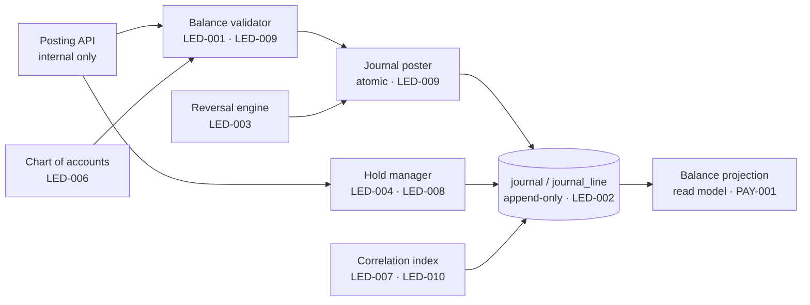
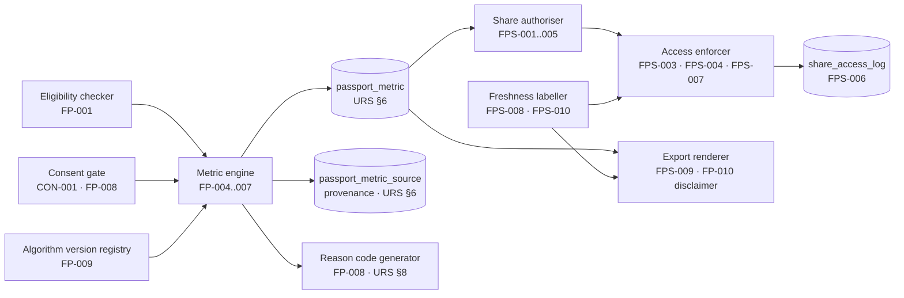
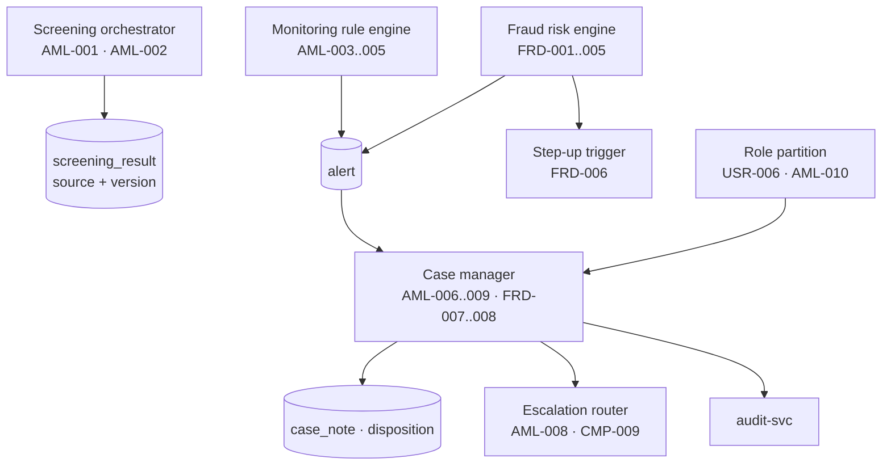
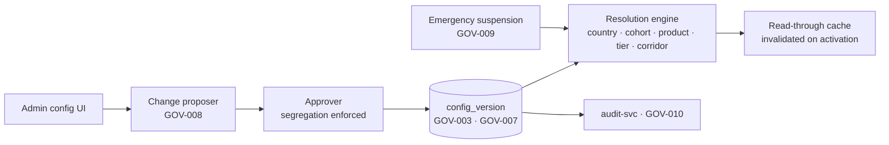
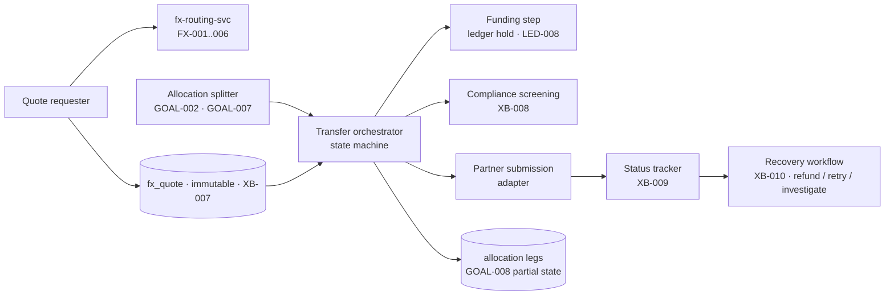
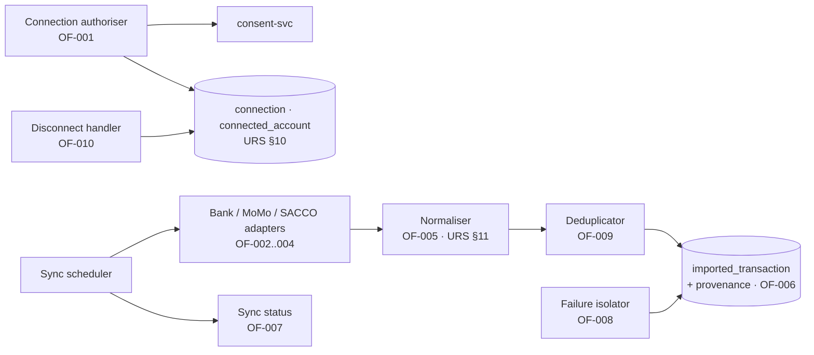

# BFR-ARC-003 — C4 Level 3: Components of Critical Containers

**Realises URS §30 Step 2.** Component decomposition is given for the six
containers where a design error is either irreversible (ledger), regulatorily
material (passport, compliance), or the source of most cross-domain coupling
(config, switch, connect).

---

## 1. `ledger-svc` — `LED-001…010`

| Component | Responsibility | Requirements | Critical rule |
|---|---|---|---|
| Balance validator | Rejects a journal whose debits ≠ credits, per currency | `LED-001`, `LED-009` | Validation happens **inside** the database transaction; a failed validation rolls back the whole business operation |
| Journal poster | Writes `journal` + `journal_line` atomically | `LED-001`, `LED-002` | No `UPDATE`/`DELETE` grant on these tables for the application role |
| Hold manager | Places, releases and expires holds | `LED-004`, `LED-008` | A hold is a distinct state, never a posted line; released holds keep their history |
| Reversal engine | Creates linked, opposite-signed corrections | `LED-003` | `reverses_journal_id` is mandatory; a reversal cannot itself be deleted |
| Chart of accounts | Account tree with mandatory currency | `LED-006` | An account has exactly one currency; cross-currency movement is two journals plus an FX account |
| Correlation index | Links business transactions to journals and partner references | `LED-007`, `LED-010` | Every journal carries `correlation_id` and, where applicable, `partner_reference` — the join key for `REC-*` |
| Balance projection | Derived read model for display | `PAY-001` | Rebuildable from journals; never a second source of truth |

**Non-negotiable:** `ledger-svc` exposes no endpoint, CLI or admin screen that
edits a posted entry (`LED-002`, `ADM-006`). Correction is only ever a new entry.

---

## 2. `passport-svc` — `FP-001…010`, `FPS-001…010`

| Component | Responsibility | Requirements | Critical rule |
|---|---|---|---|
| Eligibility checker | Applies configured minimum-data criteria | `FP-001` | Criteria come from `config-svc` (`Q-15` placeholder), never from code |
| Consent gate | Refuses any calculation input lacking a live consent | `CON-001`, `FP-008` | A metric with an unconsented source cannot be persisted |
| Metric engine | Computes the URS §7 metric set | `FP-004…007` | Deterministic and replayable: same inputs + version ⇒ same output |
| Reason code generator | Emits deterministic codes rendered via localised templates | `FP-008`, URS §8 | **No generative text** in the regulated release |
| Algorithm version registry | Binds every metric to an algorithm version | `FP-009`, `CAT-008/009`, `FH-010` | A new version never rewrites stored metrics |
| Share authoriser | Creates scoped, expiring, optionally single-use authorisations | `FPS-001…005` | Recipient must be a configured partner; no browse capability exists |
| Access enforcer | Validates scope, expiry and use count on every recipient read | `FPS-003/004/007` | Revocation and expiry are checked per request, not cached |
| Freshness labeller | Attaches calculation timestamps and stale flags | `FPS-008`, `FPS-010` | Stale data renders with a visible label in UI, API and export |
| Export renderer | Produces the controlled PDF/digital report | `FPS-009`, `FP-010` | Disclaimer is part of the template, not an optional field |

---

## 3. `compliance-svc` — `AML-001…010`, `FRD-001…010`

| Component | Responsibility | Requirements | Critical rule |
|---|---|---|---|
| Screening orchestrator | Screens at onboarding, on data change, on list refresh, before cross-border release | `AML-001/002`, `XB-008` | Result stores list source **and version** — a screen that cannot name its list version is not evidence |
| Monitoring rule engine | Evaluates configurable velocity/value/corridor rules | `AML-003/004/005` | Rules are config (`Q-17` placeholder); changing a threshold is never a code release |
| Fraud risk engine | Device, login, beneficiary, ATO signals → score + band | `FRD-001…005` | Score persisted with rule-set version |
| Step-up trigger | Forces an authentication challenge mid-transaction | `FRD-006` | Transaction cannot advance state until the challenge passes |
| Case manager | Single case model for AML and fraud | `AML-006…009`, `FRD-007/008` | Closure requires a disposition from a controlled list (`AML-009`) |
| Escalation router | Routes to authorised senior reviewers | `AML-008` | Escalation target is a role, not a named person |
| Role partition | Separates support, fraud and AML visibility | `USR-006`, `AML-010` | A support role cannot enumerate AML cases, even by ID |

**Non-negotiable:** no compliance action deletes a financial event. Blocking,
holding and reversing are state changes with audit records (`FRD-010`).

---

## 4. `config-svc` — `GOV-001…010`

Resolution precedence, evaluated in order and recorded on every decision that
depends on it: `emergency suspension → cohort override → country → product →
customer tier → corridor → global default`.

| Critical rule | Requirement |
|---|---|
| The proposer of a regulated change can never be its approver | `GOV-008` |
| A configuration value always resolves through an **effective-dated version**, never a mutable row | `GOV-003`, `GOV-007` |
| Emergency suspension is a single-actor action (speed) but is loudly audited and time-boxed | `GOV-009`, `GOV-010` |
| No service holds a private threshold | `GOV-001`, `GOV-006` |

---

## 5. `switch-svc` — `XB-001…010`, `GOAL-001…010`

| Critical rule | Requirement |
|---|---|
| Screening completes **before** `SENT_TO_PARTNER` where the corridor requires it | `XB-008` |
| An expired quote can never execute; execution re-validates expiry at the moment of use | `XB-007`, `FX-007` |
| A partially delivered multi-allocation transfer reports each leg's own state; the parent is never "completed" while a leg failed | `GOAL-008` |
| Recipient-owned and sender-directed allocations post to different account types | `GOAL-009` |

---

## 6. `connect-svc` — `OF-001…010`

| Critical rule | Requirement |
|---|---|
| A provider failure is isolated to its own `sync_run`; previously imported data is never mutated or removed by a failed sync | `OF-008` |
| Deduplication key is `(connection_id, external_transaction_id)`; where a provider offers no stable identifier, a documented composite fallback is used and recorded as lower `source_quality` | `OF-009`, `Q-20` |
| Disconnection or consent revocation stops scheduling immediately; in-flight syncs are cancelled and their results discarded | `OF-010`, `CON-005` |
| Credentials are never stored in plaintext; tokens live in the secret manager referenced by handle | URS §10, `NFR-003` |
