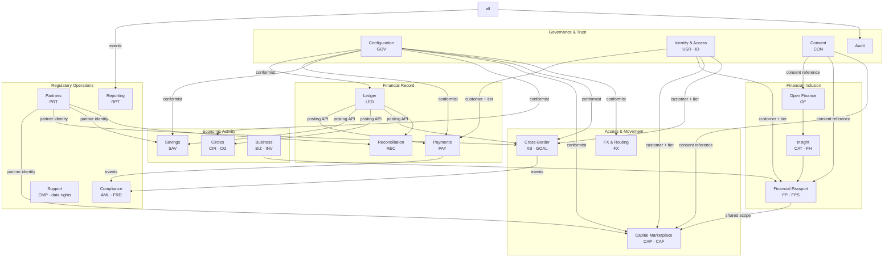

# BFR-ARC-004 — Bounded Contexts and Service Boundaries

**Realises URS §30 Step 4.**

## 1. Context map

## 2. Context definitions

| Context | Owns | Does **not** own | Ubiquitous language |
|---|---|---|---|
| **Configuration** | Thresholds, feature flags, product and provider configuration, limits, effective dating, maker-checker | Any business decision — it supplies values, it does not apply them | *config key, version, effective date, cohort, limit rule, product, legal provider* |
| **Identity & Access** | Customer, business, partner user, roles, KYC tier and status, identity evidence | Credentials (owned by auth), consent (owned by Consent) | *BuntuID, tier, verification, evidence, role, delegation* |
| **Consent** | Consent grants, scopes, purposes, versions, revocation, disclosure log | The data being consented to | *scope, purpose, duration, revocation, disclosure* |
| **Audit** | Immutable record of who did what to what, and before/after | Business meaning of the event | *actor, action, target, before, after* |
| **Ledger** | Accounts, journals, lines, holds, reversals, currency | Product rules, fees, limits | *journal, line, debit, credit, hold, reversal, correlation* |
| **Payments** | Customer payment lifecycle, beneficiaries, QR resolution, idempotency | Where the money is recorded (Ledger), whether it is allowed (Config + Identity) | *payment, authorisation, rail, receipt, reversal* |
| **Reconciliation** | Settlement files, matching, exceptions, resolution | Correcting the ledger — it raises exceptions; corrections are ledger reversals | *match, exception, settlement reference, break* |
| **Open Finance** | Institutions, connections, connected accounts, imported transactions, sync runs, provenance | Interpretation of transactions | *connection, sync, provenance, normalisation, duplicate* |
| **Insight** | Categorisation, category taxonomy, models and versions, financial-health dimensions | The Passport itself | *category, confidence, model version, correction, reason code* |
| **Financial Passport** | Metrics, provenance, explanations, shares, access log, exports | Raw transactions, credit decisions | *metric, algorithm version, provenance, share, scope, freshness* |
| **Savings** | Goals, rules, contributions, merchant reserve | The regulated savings product itself (partner) | *goal, rule, round-up, reserve, provider* |
| **Circles** | Circle definition, rule versions, membership, contributions, proposals, votes, approvals, payouts | Money movement (Ledger + Payments) | *circle, cycle, contribution, proposal, threshold, payout order* |
| **Business** | Merchant profile, QR, sales, expenses, catalogue, stock, suppliers | Payment acceptance itself (Payments) | *merchant, verified digital, self-reported, turnover, stock movement* |
| **Capital Marketplace** | Funding requests, applications, offers, decisions, disbursement and repayment status | The credit decision (partner) | *request, offer, provider, decision, disbursement* |
| **Cross-Border** | Transfers, allocations, goals, purpose, recovery | The rate (FX), the payout (partner) | *corridor, quote, leg, delivery, recovery* |
| **FX & Routing** | Quotes, routes, route decisions, provider health | Executing the transfer | *quote, route, eligibility, health, rounding policy* |
| **Compliance** | Screening, monitoring rules, alerts, cases, dispositions, risk events | Reversing money (Ledger), restricting a customer (Identity, on instruction) | *screen, alert, case, disposition, escalation, risk band* |
| **Support** | Complaints, SLA clocks, data-subject requests | The underlying transaction | *complaint, SLA, escalation, resolution, data request* |
| **Partners** | Partner profiles, capabilities, users, credentials, webhooks, fee versions | Partner business logic | *partner, capability, scope, credential, webhook, fee version* |
| **Reporting** | Report definitions, runs, exports, KPI read models | Operational data | *reporting period, KPI, definition version, export* |

## 3. Integration patterns between contexts

| From → To | Pattern | Why |
|---|---|---|
| Any → Configuration | **Conformist**, synchronous read-through with cache | Everyone must see the same threshold at the same moment |
| Any → Audit | **Fire-and-forget within the same transaction** (outbox) | Audit must not be lost, and must not be able to block business operations by being slow |
| Payments/Savings/Circles/Cross-Border → Ledger | **Synchronous, transactional posting API** | Money movement and its record must succeed or fail together (`LED-009`) |
| Open Finance → Insight → Passport | **Asynchronous, event-driven** | Import and calculation are batch-shaped and must not block the customer |
| Passport → Capital | **Published scope with explicit authorisation** | `FPS-001` forbids browsing; the sharing authorisation is the contract |
| Payments/Cross-Border → Compliance | **Event-driven for monitoring; synchronous for pre-release screening** | `AML-004` monitoring is after the fact; `XB-008` screening must gate release |
| Any → Notification | **Event-driven** | Delivery is best-effort and must never gate a financial state change |
| Any → Reporting | **Event-driven into read models** | `RPT-*` must not query operational tables |

## 4. Boundary rules

1. **No cross-context database access.** A context reads another context's data
   only through its API or its published events. No cross-schema joins.
2. **No shared mutable entities.** `customer_id` is a reference, not a shared row.
3. **Events are the only broadcast mechanism** (`BFR-STD-002`); no context polls
   another's tables.
4. **Money crosses a boundary only through the Ledger posting API.** No context
   maintains its own balance figure as a source of truth; every displayed balance
   is a projection.
5. **Every context writes audit.** No exceptions, including read-heavy contexts
   where the *read itself* is sensitive (`ADM-003`, `FPS-006`).
6. **A context that cannot resolve consent fails closed**, returning a structured
   error rather than degraded data (`CON-001`).

## 5. Mapping: 30 URS domains → 20 contexts

| URS domain | Context | URS domain | Context |
|---|---|---|---|
| 01 GOV | Configuration | 16 INV | Business |
| 02 USR | Identity & Access | 17 CAP | Capital Marketplace |
| 03 ID | Identity & Access | 18 CAF | Capital Marketplace |
| 04 CON | Consent | 19 XB | Cross-Border |
| 05 OF | Open Finance | 20 FX | FX & Routing |
| 06 CAT | Insight | 21 GOAL | Cross-Border |
| 07 FP | Financial Passport | 22 AML | Compliance |
| 08 FPS | Financial Passport | 23 FRD | Compliance |
| 09 FH | Insight | 24 CMP | Support |
| 10 PAY | Payments | 25 PRT | Partners |
| 11 LED | Ledger | 26 ADM | (cross-cutting admin BFF over all contexts) |
| 12 SAV | Savings | 27 NOT | Notification |
| 13 CIR | Circles | 28 RPT | Reporting |
| 14 CG | Circles | 29 REC | Reconciliation |
| 15 BIZ | Business | 30 NFR | Platform-wide (no context) |
