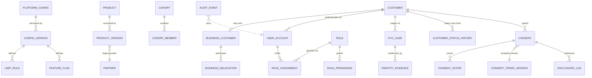
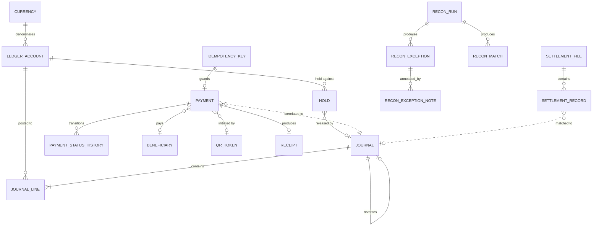
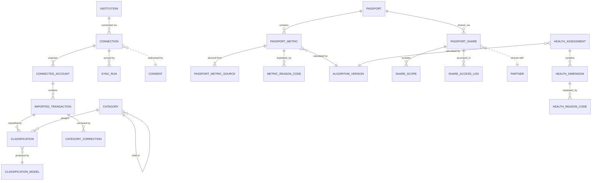
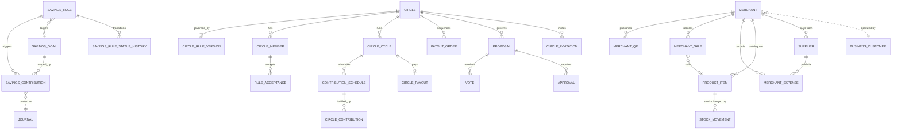
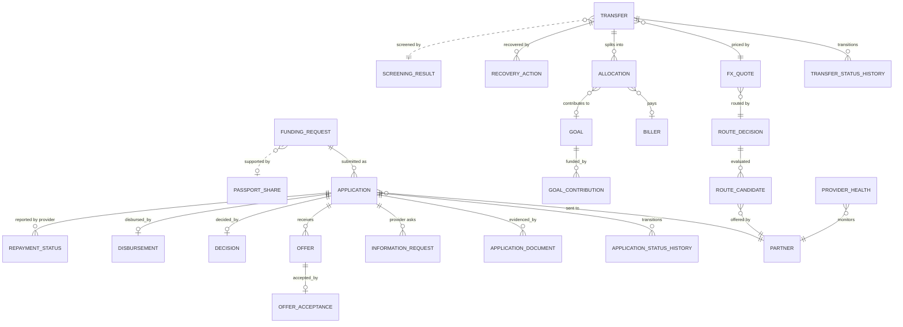
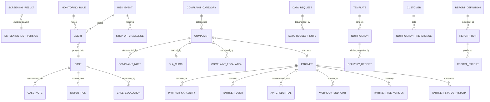

# BFR-DAT-001 — Entity Relationship Model

**Realises URS §30 Step 3.** Entities are grouped by bounded context
(`BFR-ARC-004`). No foreign key crosses a context boundary: cross-context links
are held as reference identifiers, shown in the diagrams as dashed edges.

Field-level definitions are in `BFR-DAT-002`.

---

## 1. Governance, identity, consent, audit

---

## 2. Ledger, payments, reconciliation

---

## 3. Open finance, insight, Financial Passport

---

## 4. Savings, circles, business

---

## 5. Capital marketplace, cross-border, FX

---

## 6. Compliance, support, partners, notification, reporting

---

## 7. Structural rules applied across the model

| Rule | Requirement | Implementation |
|---|---|---|
| Money is never a floating-point type | `LED-005` | `amount_minor BIGINT NOT NULL` + `currency_code CHAR(3)` on every monetary column; `scale` resolved from `CURRENCY` |
| Financial history is append-only | `LED-002`, `CIR-008`, `FRD-010`, `NFR-006` | `JOURNAL`, `JOURNAL_LINE`, `AUDIT_EVENT`, `*_STATUS_HISTORY`, `SHARE_ACCESS_LOG`, `DISCLOSURE_LOG` have no `UPDATE`/`DELETE` grant for the application role |
| Every derived number cites its version | `FP-009`, `CAT-008`, `FH-010` | `algorithm_version_id` / `model_version` is `NOT NULL` on `PASSPORT_METRIC`, `CLASSIFICATION`, `HEALTH_DIMENSION` |
| Every use of customer financial data cites consent | `CON-001/009`, `FP-008`, `CAP-005` | `consent_id` is `NOT NULL` on `CONNECTION`, `PASSPORT_METRIC_SOURCE`, `DISCLOSURE_LOG`, `PASSPORT_SHARE` |
| Every product names its legal provider | `GOV-002`, `SAV-009`, `CAP-002` | `PRODUCT_VERSION.legal_provider_partner_id` is `NOT NULL` |
| State changes are recorded, not overwritten | §5, `PAY-007`, `XB-009`, `CAP-010` | `*_STATUS_HISTORY` table per stateful entity, with `from_state`, `to_state`, `reason`, `actor`, `occurred_at` |
| Nothing regulated is un-versioned | `GOV-003/007`, `CON-010`, `CIR-005`, `PRT-008` | Shared `versioned_artefact` pattern: `(version, effective_from, effective_to, author_id, approver_id, status)` |
| Imported data keeps its origin | `OF-006` | `IMPORTED_TRANSACTION.source_system`, `.external_transaction_id`, `.raw_reference`, `.source_quality` all mandatory |
| Soft delete is not used for financial entities | `LED-002`, `PRT-010` | Deactivation is a status change; rows persist |

## 8. Reference data

| Table | Contents | Source of truth |
|---|---|---|
| `CURRENCY` | code, name, minor-unit scale, rounding default | Configuration — seeded per `Q-11` |
| `CATEGORY` | hierarchical transaction taxonomy | Configuration (`CAT-002`) |
| `COMPLAINT_CATEGORY` | complaint taxonomy | Configuration (`CMP-002`) |
| `DISPOSITION_TYPE` | permitted case outcomes | Configuration (`AML-009`, `FRD-008`) |
| `PURPOSE_CODE` | funding and remittance purposes | Configuration (`CAP-004`, `GOAL-001`) — corridor codes pending `Q-10` |
| `INSTITUTION` | connectable banks, MNOs, SACCOs | Partner management (`PRT-001`) |
| `BILLER` | approved institutions for direct payment | Partner management (`GOAL-006`) — pending `Q-27` |
| `ROLE`, `ROLE_PERMISSION` | RBAC matrix | Configuration (`USR-004`, `USR-006`) |
