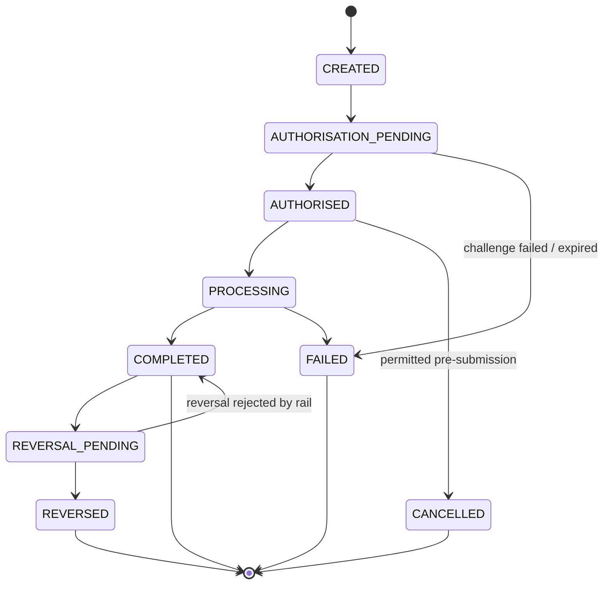
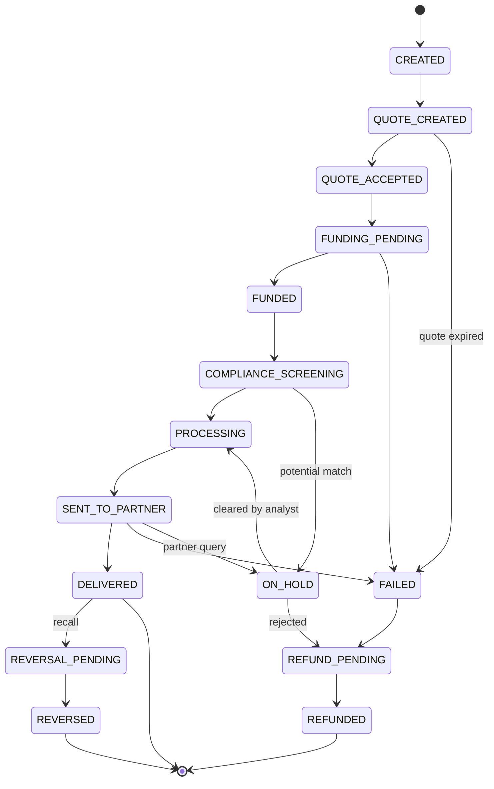
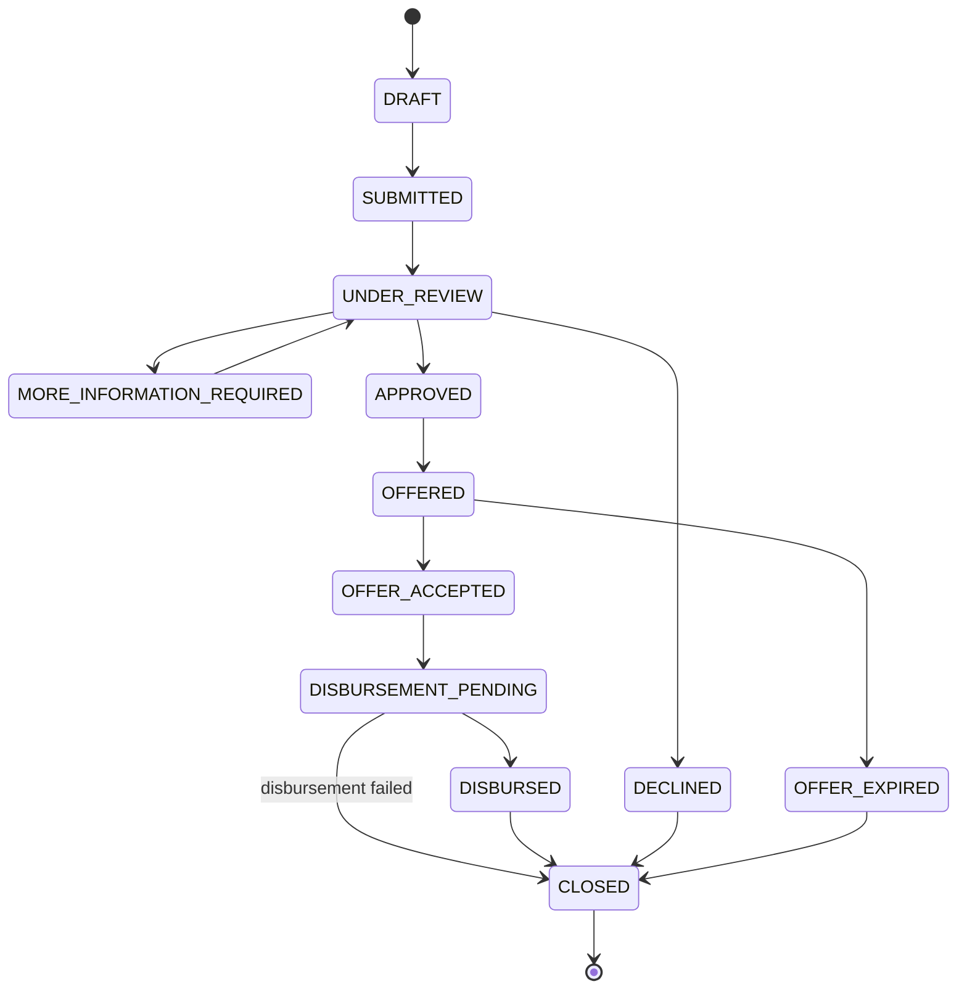

# BFR-STD-001 — Financial State Machines

**Realises URS §5.**

> "Claude shall not use arbitrary free-text transaction status. Every financial
> entity shall have a controlled state machine. Invalid transitions must be
> rejected."

## 1. Implementation rules (binding on all financial entities)

| Rule | Consequence |
|---|---|
| States are a database enum, never free text | A new state requires a migration and a design change, not a string literal |
| Transitions are declared in one table per entity and enforced in one guard function | No service may transition an entity by writing the column directly |
| An invalid transition raises a structured error and changes nothing | `STATE_TRANSITION_INVALID` with the attempted `from`/`to` (`NFR-005`) |
| Every transition writes a `*_status_history` row | `from_state`, `to_state`, `reason`, `actor`, `occurred_at`, `correlation_id` |
| Terminal states accept no outbound transitions except those drawn below | Prevents "un-completing" a completed payment |
| The customer-facing label of a state is a localisation key, not the enum | URS §18, `CMP-006` (plain language) |
| A state change caused by a partner carries the partner reference | `PAY-008`, `XB-009`, `CAF-006` |

## 2. Payment (`PAY-*`)

| Guard | Requirement |
|---|---|
| `CREATED → AUTHORISATION_PENDING` requires fee and recipient displayed and confirmed | `PAY-005`, `PAY-006` |
| `AUTHORISATION_PENDING → AUTHORISED` requires KYC tier permission and limit check | `ID-007`, `GOV-006` |
| Step-up challenge, when demanded by fraud rules, blocks `→ AUTHORISED` | `FRD-006` |
| `→ PROCESSING` places a ledger hold; `→ COMPLETED` converts it to a posting | `LED-004`, `LED-008` |
| `→ COMPLETED` only on authoritative rail confirmation | `PAY-008` |
| `→ REVERSED` posts a linked reversal journal, never an edit | `LED-003`, `FRD-010` |
| Re-submitting the same idempotency key returns the existing payment, never a new one | `PAY-009`, `NFR-004` |

## 3. Cross-Border Transfer (`XB-*`, `GOAL-*`)

| Guard | Requirement |
|---|---|
| `QUOTE_ACCEPTED` re-validates quote expiry at the instant of acceptance | `XB-007`, `FX-007` |
| `FUNDED → COMPLIANCE_SCREENING` is mandatory where the corridor config requires it; there is no path from `FUNDED` to `SENT_TO_PARTNER` | `XB-008` |
| `SENT_TO_PARTNER` requires a healthy, eligible route recorded on the transfer | `FX-003…006` |
| Any terminal failure creates a recovery action record | `XB-010` |
| A transfer with allocations reaches `DELIVERED` only when every leg is delivered; otherwise it reports `PARTIALLY_DELIVERED` at the allocation level | `GOAL-008` |
| Customer-visible status is derived from this machine only | `XB-009` |

## 4. Financing Application (`CAP-*`, `CAF-*`)

| Guard | Requirement |
|---|---|
| `DRAFT → SUBMITTED` requires an explicit partner selection and a live consent | `CAP-006`, `CON-001` |
| Only the provider's own response drives `APPROVED`/`DECLINED`; BuntuFin never sets these | `CAF-003` |
| A decline reason is displayed only if the provider supplied one | `CAF-004` |
| `OFFERED → OFFER_ACCEPTED` re-checks offer expiry at acceptance | `CAF-009` |
| `→ DISBURSED` requires partner confirmation, never customer report | `CAF-006` |
| Every state is visible to the customer in plain language | `CAP-010` |

## 5. Supporting state machines

| Entity | States | Requirements |
|---|---|---|
| Customer | `PENDING → ACTIVE → {SUSPENDED, RESTRICTED} → CLOSED` | `USR-007`, `ADM-007` |
| KYC case | `PENDING → {AUTO_PASS, AUTO_FAIL, MANUAL_REVIEW} → {MANUAL_PASS, MANUAL_FAIL}` | `ID-005` |
| Consent | `ACTIVE → {EXPIRED, REVOKED, SUPERSEDED}` | `CON-005/010` |
| Connection | `PENDING → ACTIVE → {DEGRADED, FAILED} → {DISCONNECTED, CONSENT_REVOKED}` | `OF-007/010` |
| Savings rule | `DRAFT → ACTIVE → {PAUSED → ACTIVE} → CANCELLED` | `SAV-005/006` |
| Circle | `DRAFT → ACTIVE → {SUSPENDED} → SETTLEMENT_PENDING → CLOSED` | `CIR-010`, `CG-010` |
| Proposal | `OPEN → {PASSED, REJECTED, EXPIRED} → EXECUTED` | `CG-001/002` |
| Case | `OPEN → IN_REVIEW → {ESCALATED, PENDING_INFO} → CLOSED` | `AML-008/009` |
| Complaint | `OPEN → INVESTIGATING → {PENDING_CUSTOMER, ESCALATED} → RESOLVED → CLOSED` | `CMP-006/008/009` |
| Recon exception | `OPEN → ASSIGNED → INVESTIGATING → RESOLVED` | `REC-007/008` |
| Partner | `DRAFT → PENDING_APPROVAL → ACTIVE → {SUSPENDED} → OFFBOARDED` | `PRT-003/009/010` |
| Journal posting | `PENDING → POSTED` (no reverse path; corrections are new journals) | `LED-002/003/004` |
